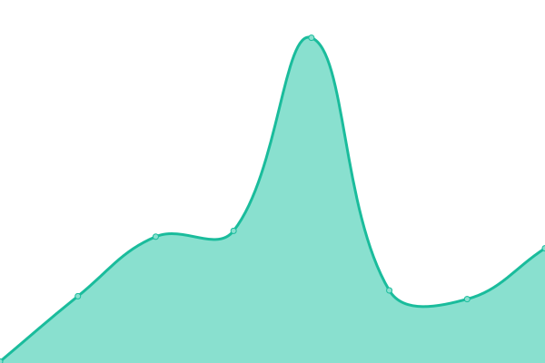
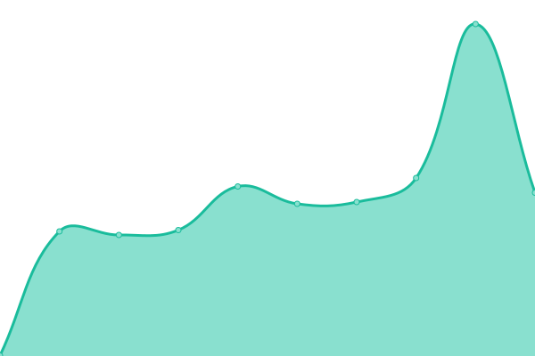

# [📈 Live Status](https://rclaros.github.io/pages-stack): <!--live status--> **🟩 All systems operational**

This repository contains the open-source uptime monitor and status page for [Reynaldo Claros](http://claros-dev.blogspot.com), powered by [Upptime](https://github.com/upptime/upptime).

With [Upptime](https://upptime.js.org), you can get your own unlimited and free uptime monitor and status page, powered entirely by a GitHub repository. We use [Issues](https://github.com/rclaros/pages-stack/issues) as incident reports, [Actions](https://github.com/rclaros/pages-stack/actions) as uptime monitors, and [Pages](https://rclaros.github.io/pages-stack) for the status page.

<!--start: status pages-->
<!-- This summary is generated by Upptime (https://github.com/upptime/upptime) -->
<!-- Do not edit this manually, your changes will be overwritten -->
<!-- prettier-ignore -->
| URL | Status | History | Response Time | Uptime |
| --- | ------ | ------- | ------------- | ------ |
|  [Google](https://www.google.com) | 🟩 Up | [google.yml](https://github.com/rclaros/pages-stack/commits/HEAD/history/google.yml) | 

 89ms
     
 | 

<a href="https://rclaros.github.io/pages-stack/history/google">100.00%</a>
    

|  [Wikipedia](https://en.wikipedia.org) | 🟩 Up | [wikipedia.yml](https://github.com/rclaros/pages-stack/commits/HEAD/history/wikipedia.yml) | 

 158ms
     
 | 

<a href="https://rclaros.github.io/pages-stack/history/wikipedia">100.00%</a>
    

|  [Sotech](https://sotech.com.pe) | 🟩 Up | [sotech.yml](https://github.com/rclaros/pages-stack/commits/HEAD/history/sotech.yml) | 

 6591ms
     
 | 

<a href="https://rclaros.github.io/pages-stack/history/sotech">77.53%</a>
    

|  [Sotechcloud](https://sotechcloud.com) | 🟩 Up | [sotechcloud.yml](https://github.com/rclaros/pages-stack/commits/HEAD/history/sotechcloud.yml) | 

 5527ms
     
 | 

<a href="https://rclaros.github.io/pages-stack/history/sotechcloud">29.90%</a>
    

<!--end: status pages-->

[**Visit our status website →**](https://rclaros.github.io/pages-stack)

## 📄 License

- Powered by: [Upptime](https://github.com/upptime/upptime)
- Code: [MIT](./LICENSE) © [Reynaldo Claros](http://claros-dev.blogspot.com)
- Data in the `./history` directory: [Open Database License](https://opendatacommons.org/licenses/odbl/1-0/)
